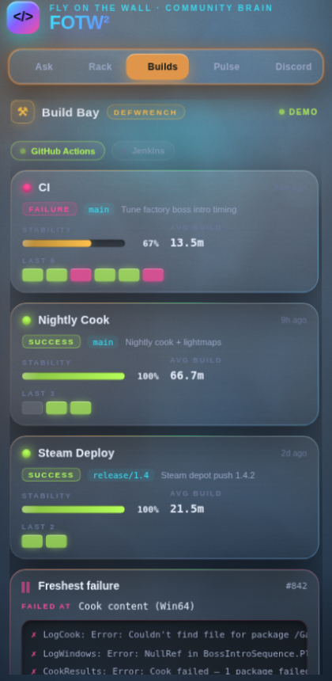
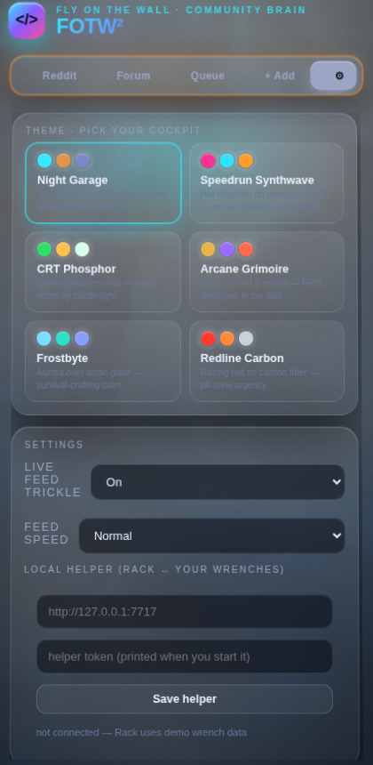
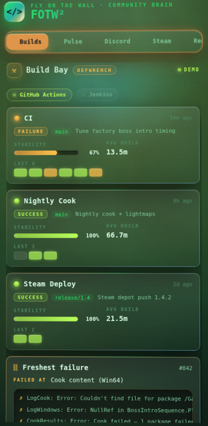
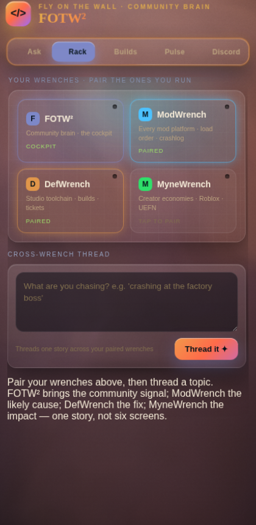

# FOTW² — Fly On The Wall

**The cockpit for game modders and developers.** A browser side panel + MCP server that listens to your communities (Discord, Reddit, Steam, forums, GitHub), threads what they're saying into one story across your tools, and drafts responses that never post without your approval.

> Ask what the community is saying, see whether others hit the same wall, watch your builds break in the same window the bug reports land, draft the reply — and approve every word before it ships.

FOTW² is the **face of the MCPwrench family**: [ModWrench] (mod platforms), [DefWrench](https://github.com/171county/DefWrench) (studio toolchain), and MyneWrench (creator economies) are headless MCP servers; FOTW² is the one UI that ties them together.

## What's inside

```
The browser extension (MV3 side panel — the product)
├─ Ask        page-aware community questions + targeted broadcast drafts
├─ Rack       pair your wrenches; thread one story across all of them
├─ Builds     ★ the Build Bay — DefWrench live: pipeline health as a game HUD
│             (HP-bar stability, build combo strips, failure terminal)
├─ Pulse      every connected source, one interleaved live feed
├─ Sources    per-community feeds; read the page you're on via your own session
├─ Queue      approval-first drafts — nothing ever auto-posts
└─ Settings   six game-genre themes, feed controls, local-helper pairing
```

**Six themes, one cockpit.** Night Garage (default), Speedrun Synthwave, CRT Phosphor, Arcane Grimoire, Frostbyte, and Redline Carbon — full reskins (palette, typography, even the WebGL aurora) picked in Settings, persisted locally.

| Build Bay · Night Garage | Theme picker | Build Bay · CRT Phosphor | Rack · Arcane Grimoire |
|---|---|---|---|
|  |  |  |  |

More states + the full review/integration report: [docs/REPORT-2026-06-11-integration.md](docs/REPORT-2026-06-11-integration.md).

## Architecture

```
FOTW² extension (side panel UI, no secrets, no auto-posting)
   └─ fotw-helper        loopback-only HTTP bridge (127.0.0.1, token-gated)
        ├─ DefWrench     stdio MCP → GitHub Actions / Jenkins   (live today)
        ├─ ModWrench     stdio MCP → mod platforms              (contract ready)
        └─ MyneWrench    stdio MCP → creator economies          (contract ready)
@help-me-comms/mcp-server  the FOTW² MCP itself (community_help, drafts, queue)
```

- The **helper** relays only an allowlisted set of read-only tools and holds zero credentials; wrench creds live in each wrench's own keychain/env.
- Every wrench answers the same spine contract (`dw_correlate` et al.): topic in → weighted findings out. The **Rack** threads them into one story; the **Build Bay** renders DefWrench's slice in depth.
- No helper running? Everything degrades to clearly-badged demo data — the cockpit always works.

## Quick start

```bash
pnpm install && pnpm -r build && pnpm -r test
```

**Load the extension:** `chrome://extensions` → Developer mode → *Load unpacked* → `extensions/browser/`.

**Go live with your wrenches (optional):**

1. Install a wrench, e.g. DefWrench: `npm i -g @defwrench/cli` (or use `npx`).
2. Copy [`configs/examples/helper.wrenches.json`](configs/examples/helper.wrenches.json) to `~/.fotw/wrenches.json` and point it at your wrench + project.
3. Start the bridge: `node packages/helper/dist/index.js` — it prints a token.
4. FOTW² → Settings → *Local helper*: paste `http://127.0.0.1:7717` + the token.
5. Open **Builds** — that's your CI now. Open **Rack** → *Thread it* — that's your story.

## The MCP server

`@help-me-comms/mcp-server` exposes the comms brain to any MCP client (Claude Desktop, Claude Code, Cursor…): `get_workspace_context`, `community_help`, `get_comms_thread`, `draft_comms_action`, `queue_comms_action`, `suggest_more_sources`.

```json
{
  "mcpServers": {
    "fotw": { "command": "npx", "args": ["-y", "@help-me-comms/mcp-server"] }
  }
}
```

Registry metadata lives in [`server.json`](server.json) (`io.github.171county/flyonwallwrench`); publish with `npm publish` + `mcp-publisher publish` once the npm scope is live.

## Trust posture (non-negotiable)

1. **No secrets in the extension or helper.** Live page reads ride your own logged-in session after a per-site Connect grant.
2. **Approval-first writes.** Posting = draft + paste. FOTW² never posts on its own.
3. **Ephemeral evidence.** No message bodies stored; only your drafts, picks, and settings persist, locally.
4. **Read-only bridges.** The helper relays an explicit allowlist of read tools — write-shaped tools are refused at the door.
5. **Open-core.** MIT base (core, adapters, the WrenchBridge contract); the cross-wrench correlation spine (`@fotw/pro`) is BUSL-1.1 source-available.

## Repo layout

```text
extensions/browser/    the FOTW² side panel (MV3, esbuild, vanilla TS, themed)
extensions/vscode/     VS Code companion (webview HUD)
apps/web/              optional team-host web app (Next.js)
packages/core/         types, routing, evidence ranking, drafts, privacy (MIT)
packages/adapters/     source adapters: mock + real read-only (MIT)
packages/mcp-server/   the FOTW² MCP server (stdio)
packages/helper/       fotw-helper — loopback bridge to local MCP wrenches
packages/pro/          cross-wrench correlation spine (BUSL-1.1)
configs/examples/      workspace / provider / source / wrench config examples
docs/ · specs/         architecture, trust model, tool contracts, threat model
installer/ · scripts/  install scripts, fixture guards, proofs-of-concept
```

## Deep docs

[`docs/00-product-brief.md`](./docs/00-product-brief.md) · [`docs/01-architecture.md`](./docs/01-architecture.md) · [`docs/02-trust-and-data-boundaries.md`](./docs/02-trust-and-data-boundaries.md) · [`docs/03-mcp-tool-surface.md`](./docs/03-mcp-tool-surface.md) · [`docs/STRATEGY.md`](./docs/STRATEGY.md) · [`specs/tool-schemas.json`](./specs/tool-schemas.json)
