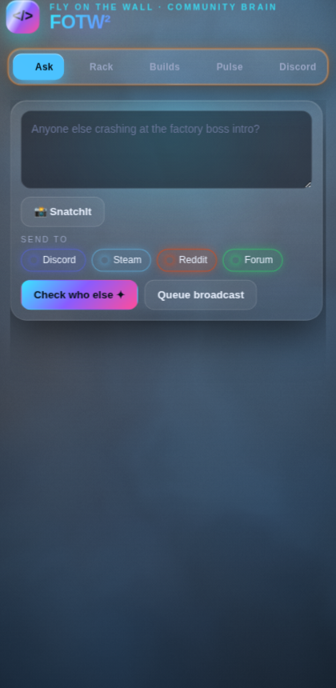
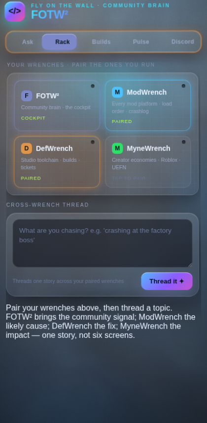
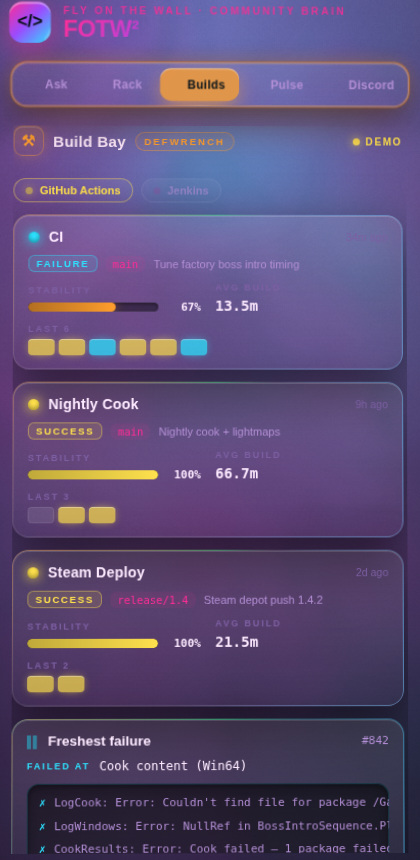
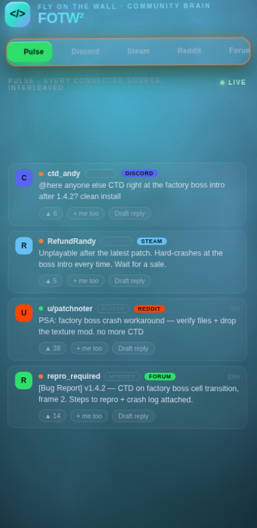

# Review & Integration Report — 2026-06-11

**Scope:** DefWrench + FlyOnWallWrench (FOTW²), branch `claude/cool-hypatia-v6jgm6` in both repos.
**Goal:** repo review → registry-ready MCP → DefWrench wired live into the FOTW² web extension → game-tailored UI with a full theme system.

---

## 1. What the repos are

- **DefWrench** — headless MCP meta-server for game developers. BuildWrench (CI/CD
  bridge: GitHub Actions + Jenkins, 7 read-only tools) shipped; detect-first product
  catalog auto-activates only what's relevant to the machine.
- **FlyOnWallWrench (FOTW²)** — the cockpit: an MV3 side-panel extension (Ask, Rack,
  Pulse, source feeds, approval Queue) + community-intelligence MCP server + a
  loopback helper that bridges the extension to local MCP wrenches.

The two were designed for each other (FOTW²'s strategy: *wrenches are headless;
FOTW² is the only face tying them together*) — the live wiring just hadn't been
built. This session built it.

## 2. Review findings (fixed in this session)

| # | Finding | Where | Fix |
|---|---------|-------|-----|
| 1 | Helper's `mcp` mode was unreachable dead code — `DEFAULT_REGISTRY` hardcoded all wrenches to mock; no config path existed to point at a real wrench | `packages/helper/src/wrenchRegistry.ts`, `index.ts` | `loadRegistry()`: `~/.fotw/wrenches.json` or `$FOTW_HELPER_WRENCHES`, merged over mock defaults; example in `configs/examples/helper.wrenches.json` |
| 2 | Fallback findings hardcoded `wrench: "mod"` for every wrench | `packages/helper/src/mcpClient.ts:80` | wrench id is now a parameter |
| 3 | Deprecated `server.tool()` API throughout; SDK declared `^1.0.4` but lockfile resolved 1.29.0 (silent float) | DefWrench `packages/{build,cli}` | migrated all 11 tools to `registerTool()` with titles + read-only annotations; range pinned `^1.29.0` |
| 4 | Importing `@defwrench/build`'s package root **booted an MCP server** (`main` pointed at the bin) | `packages/build/package.json` | `.` now resolves to a library barrel (`lib.ts`); bin keeps the boot script |
| 5 | Stale brand string "Help Me never posts…" in the approval queue; README predated the FOTW² rebrand and the shipped product | extension + README | both rewritten |
| 6 | No CI in FlyOnWallWrench | — | GitHub Actions: pnpm build + tests + sensitive-fixtures guard, Node 20/22 |
| 7 | No registry/distribution metadata anywhere | both repos | see §3 |

**Known remaining (non-blockers):** Jenkins provider doesn't enumerate nested
folder jobs; DefWrench `auth.ts` OAuth/token-refresh scaffolded but unimplemented;
FOTW² adapters beyond Discord/Reddit/Steam/GitHub are intentional M2 mocks;
SnatchIt drag-capture needs a real-device test (DPR/scroll alignment can't be
verified headlessly).

## 3. Registry readiness (what "ready" means here)

Both MCPs are staged for the official MCP Registry (`registry.modelcontextprotocol.io`):

- **DefWrench** → `io.github.171county/defwrench`
  - `server.json` (schema 2025-12-11) at repo root; npm package `@defwrench/cli`,
    stdio transport, env vars documented.
  - `mcpName`, `files`, `bin`, `publishConfig`, `repository` on all three packages (0.1.0).
  - `.github/workflows/publish.yml`: GitHub Release → npm publish `core→build→cli`
    → `mcp-publisher` via GitHub OIDC.
- **FOTW²** → `io.github.171county/flyonwallwrench`
  - `server.json` at repo root; npm package `@help-me-comms/mcp-server`
    (bins: `fotw-mcp`, `help-me-comms-mcp`), publish metadata + `mcpName` set.

**Owner steps remaining (cannot be done from CI/sandbox):**
1. Claim npm scopes `@defwrench` and `@help-me-comms`; add `NPM_TOKEN` secret to DefWrench.
2. Publish a GitHub Release on DefWrench (workflow does npm + registry), or manually:
   `npm publish --workspace … --access public` then `mcp-publisher login github && mcp-publisher publish`.
3. Chrome Web Store listing when ready: icon set + privacy disclosures (manifest + trust posture already aligned).

## 4. The integration spine (new)

```
FOTW² extension ──HTTP (127.0.0.1, token)──> fotw-helper ──stdio MCP──> defwrench
     Build Bay / Rack                          read-only allowlist        bw_* + dw_correlate
```

- **`dw_correlate`** (new DefWrench meta-tool): free-text topic → weighted findings
  (`build_failing`, `pipeline_flaky`, `failure_signals`, `build_recovered`) in the
  shared WrenchFinding shape the spine threads. GitHub project inferred from the
  git origin remote (or `DEFWRENCH_PROJECT`); bounded fan-out; one log fetch max.
- **Helper tool relay** (new): `POST /wrench/:id/tool` behind a strict read-only
  allowlist; write-shaped tools refused; mock-mode wrenches serve canned demo data
  so the cockpit is rich with zero setup.
- Verified live: helper spawned the real `defwrench` binary, relayed
  `dw_status` and `dw_correlate` over loopback, refused non-allowlisted tools.

## 5. The UI (new)

- **Build Bay** (Builds tab): DefWrench as a game HUD — status orbs, HP-bar
  stability per pipeline, build combo strips, freshest-failure terminal with
  extracted error lines, provider LEDs, Live/Demo badge, and a *"Thread it to the
  community ✦"* handoff into the Rack.
- **Theme engine** (`src/themes.ts`): six full personalities — **Night Garage**
  (default), **Speedrun Synthwave**, **CRT Phosphor**, **Arcane Grimoire**,
  **Frostbyte**, **Redline Carbon**. Palette, typography, radii, and the WebGL
  aurora (shader uniforms) all repaint live; picked in Settings, persisted locally;
  popup themes too. `styles.css` fully tokenized — no hardcoded accent colors left.

### Gallery

| | | |
|---|---|---|
|  |  |  |
| Ask · Night Garage | Build Bay · Night Garage | Rack · Night Garage |
|  |  |  |
| Settings · theme picker | Build Bay · Speedrun Synthwave | Build Bay · CRT Phosphor |
|  |  |  |
| Rack · Arcane Grimoire | Pulse · Frostbyte | Queue · Redline Carbon |

## 6. Verification

- DefWrench: build + strict typecheck clean; **51 tests green** (11 new for the
  findings collector); stdio smoke test listed all 12 tools with annotations.
- FOTW²: all 9 workspace packages build; **39 tests green** (6 new for the helper
  relay + registry config).
- Extension: bundled clean; loaded in headless Chromium over HTTP with **zero page
  errors**; every screenshot above is from the real bundle.

## 7. Ideas for next sessions

ModWrench/MyneWrench bays (the contracts are already in place) · Firefox port
(`browser.*` shims + MV3 differences) · real M2 adapters (YouTube/Twitch/Slack/
Matrix) · signed installers · Chrome Web Store assets · `dw_correlate` ticket/VCS
findings once AssetWrench ships.
